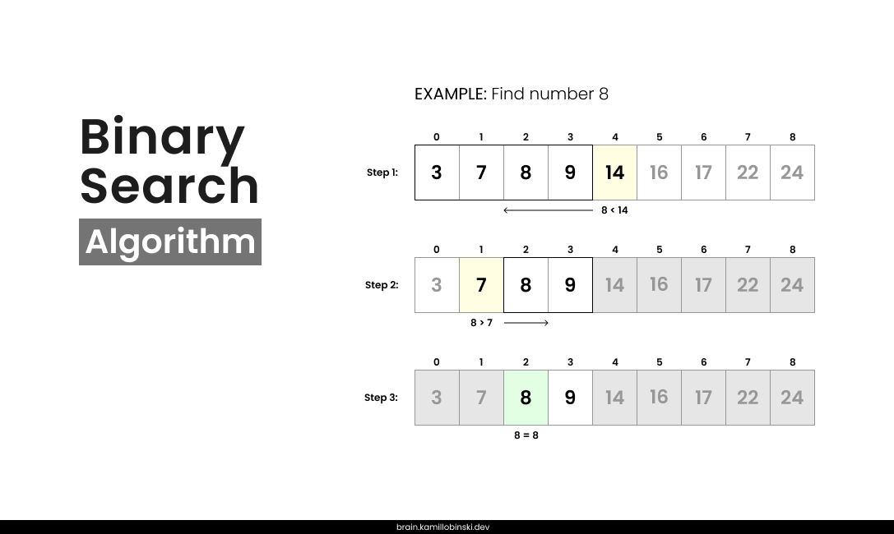

Binary Search is an efficient algorithm used for finding an element in a sorted list. It works by repeatedly dividing the search range in half. If the search key’s value is smaller than the element in the middle of the range, the algorithm narrows the range to the lower half. Otherwise, it narrows the range to the upper half. This process continues until the key is found or the range becomes empty.

## Example

1. Find the middle element of the array.
2. Compare the target element with the middle element:
    - if they are equal, the element is found.
    - If the target element is smaller, search the left half of the array.
    - the target element is larger, search the right half of the array.
3. Repeat the process until the element is found or the search range is empty.

Let’s consider an example where we search for the number `8` in the following array of numbers:

```java
[3, 7, 8, 9, 14, 16, 17, 22, 24]
```



Search for the middle element.

```java
[3, 7, 8, 9, ->14<-, 16, 17, 22, 24]
```

Compare the target element with the middle element.

```java
8 < 14 // The target element is smaller than the middle element, so we move to the left half of the array
[3, 7, 8, 9]
```

Repeat the process of finding the middle element until the target element is found.

## Java Implementation

> [!info] Iterative method

```java
public class IterativeSolution {
    public static int binarySearch(int[] arr, int target) {
        int left = 0;
        int right = arr.length - 1;

        while (left <= right) {
            int mid = left + (right - left) / 2;
            
            if (arr[mid] == target) {
                return mid; // Element found
            } else if (arr[mid] < target) {
                left = mid + 1; // Search the right half
            } else {
                right = mid - 1; // Search the left half
            }
        }

        return -1; // Element not found
    }
}
```

> [!info] Recursive method

```java
public class RecursiveSolution {
    public static int binarySearchRecursive(int[] arr, int left, int right, int target) {
        if (left > right) {
            return -1; // Element not found
        }

        int mid = left + (right - left) / 2;

        if (arr[mid] == target) {
            return mid; // Element found
        } else if (arr[mid] < target) {
            return binarySearchRecursive(arr, mid + 1, right, target); // Search the right half
        } else {
            return binarySearchRecursive(arr, left, mid - 1, target); // Search the left half
        }
    }
}
```

## Time Complexity

- Best case: `O(1)`
- Average Case: `O(logn)`
- Worst-case: `O(logn)`

## Advantages

- When it comes to comparing large data, it is quite efficient as it works on the technique to eliminate half of the array element.
  - It has less compilation time and thus better time complexity.
  - As it breaks the array in half, it is considered an improvement over linear search.
- Simple implementation.

## Disadvantages

- It can only be implemented over a sorted array. The process of sorting and searching in an unsorted array will take time. Thus, binary search is not a good option in such cases.
- Not suitable for dynamic arrays.

## Usage

- **Searching in sorted arrays**: efficient for finding elements in sorted arrays.
- **Database queries**: quickly locates records in sorted tables.
- **Finding the closest match**: finds values closest to a target in sorted lists.
- **Interpolation search**: serves as a starting point for faster search algorithms.

---

**Parent:** [[_Search]]