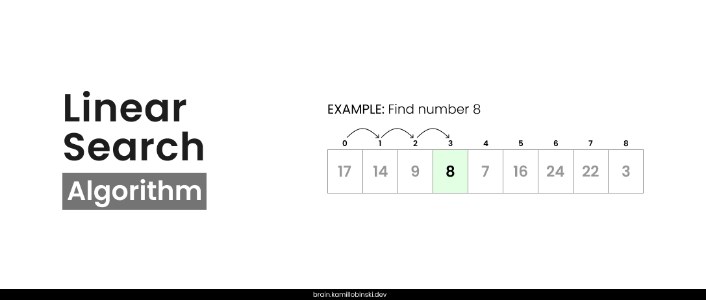

Linear Search is a simple search algorithm that sequentially examines each element of an array or list until it finds the desired element or reaches the end of the dataset.

## Example

1. Start with the first element of the array.
2. Compare the target element with the current element of the array:
   - the elements are equal, we return the index of that element.
   - If the elements are not equal, we move to the next element.
3. The process repeats until the element is found or the end of the array is reached.



Let’s consider an example where we search for the number `8` in the following array of numbers:

```java
[17, 14, 9, 8, 7, 16, 24, 22, 3]
```

Compare the target with the first element.

```java
[->17<-, 14, 9, 8, 7, 16, 24, 22, 3]
17 != 8 // Move to the next element
```

Compare the target with the second element.

```java
[17, ->14<-, 9, 8, 7, 16, 24, 22, 3]
14 != 8 // Move to the next element
```

Repeat the process of iterating over the array and comparing each element until the target element is found.

## Java Implementation

```java
public class Solution {
    public static int linearSearch(int[] arr, int target) {
        for (int i = 0; i < arr.length; i++) {
            if (arr[i] == target) {
                return i;
            }
        }
        return -1;
    }

    public static void main(String[] args) {
        int[] numbers = {1, 3, 5, 7, 9};
        int target = 7;

        int result = linearSearch(numbers, target);
        // result == -1 means number not found
        // result != -1 means number found and the result is an index of this element
    }
}
```

## Time Complexity

- Best case: `O(1)`
- Worst case: `O(n)`

## Advantages

- Simple implementation.
- Works on sorted and unsorted datasets.
- Can be used on any data structure (arrays, lists etc.).
- Does not require additional memory or data structures.

## Disadvantages

- Slow for large datasets.
- Searches each element sequentially, even if the data is sorted.
- Performance decreases significantly as the dataset size increases.

## Usage

- **Small datasets**: ideal when performance differences are negligible.
- **Unsorted data**: works well without requiring preprocessing.
- **Rare searches**: suitable for infrequent searches to keep it simple.
- **Dynamic data**: effective when data is frequently updated.
- **Specific applications**: great for simplicity in teaching or embedded systems.

---

**Parent:** [[_Search]]